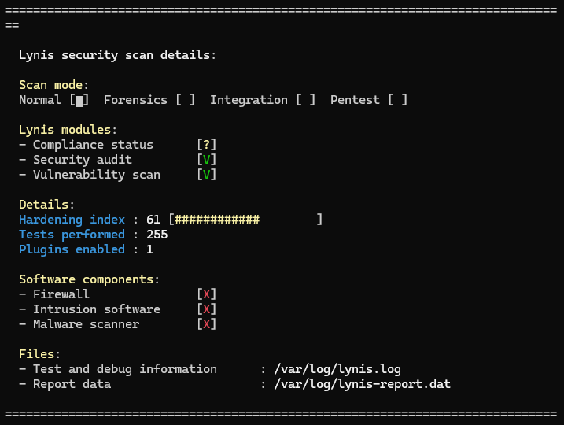
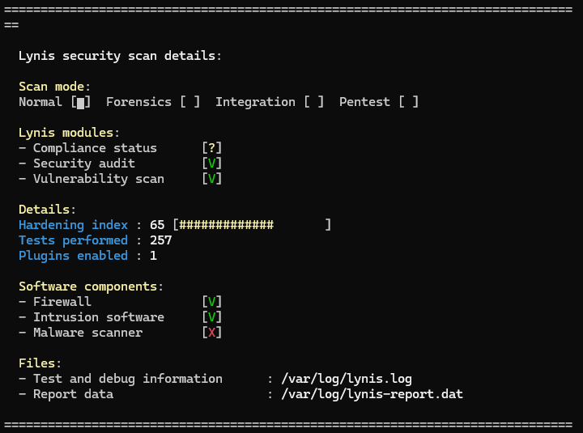
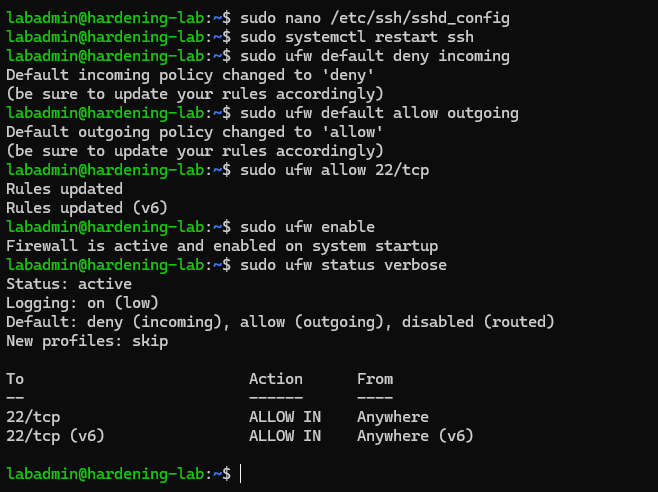
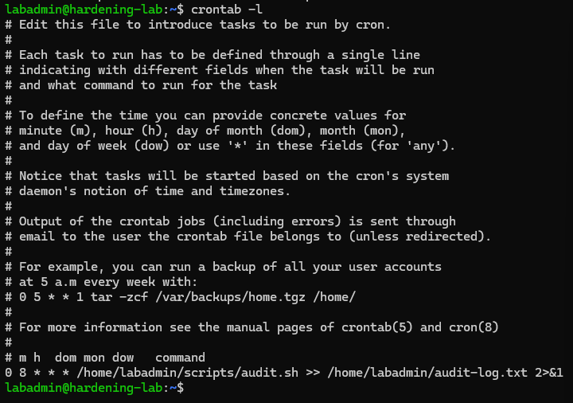

# Linux Server Hardening Lab

A hands-on lab hardening a fresh Ubuntu Server install (SSH, firewall, intrusion prevention) inside VirtualBox, then building an automated script to continuously check the server's security posture.

## Results

**Lynis Hardening Index: 61 → 65**

| Component | Before | After |
|---|---|---|
| Firewall | Not active | Active (UFW, default-deny) |
| Intrusion prevention | Not present | Active (fail2ban) |
| Root SSH login | Allowed | Disabled |

## What I Did

- Installed a fresh Ubuntu Server VM and ran a baseline Lynis security audit
- Disabled SSH root login (`PermitRootLogin no`) to remove the most commonly targeted account from remote access entirely
- Configured UFW with a default-deny policy, opening only the SSH port
- Installed and enabled fail2ban to automatically block IPs after repeated failed login attempts
- Re-ran Lynis to confirm and measure the improvement
- Wrote a Bash script that checks recent failed logins, fail2ban status, and firewall status
- Scheduled that script with cron to run daily and log its output automatically

## Evidence

<table>
<tr>
<td align="center"><b>Before</b><br></td>
<td align="center"><b>After</b><br></td>
</tr>
</table>

**Firewall configuration and status:**



**Automated audit scheduled via cron:**



## The Audit Script

`audit.sh` checks the server's security-relevant status in one command instead of running several manually:

```bash
#!/bin/bash
echo "=== Audit: $(date) ==="
echo "--- Failed logins ---"
grep "Failed password" /var/log/auth.log 2>/dev/null | tail -5
echo "--- fail2ban status ---"
sudo fail2ban-client status sshd
echo "--- Firewall status ---"
sudo ufw status
```

It's scheduled via cron to run daily:

```
0 8 * * * /home/labadmin/scripts/audit.sh >> /home/labadmin/audit-log.txt 2>&1
```

## Troubleshooting

**SSH connection aborted on first connect**

Trying to SSH into the VM failed immediately with `kex_exchange_identification: read: Connection aborted`. The TCP connection opened but was cut off before SSH could even exchange its banner. After confirming the VirtualBox port forwarding rule was correct, I checked the VM's running services (`systemctl list-units`) and found `ssh` wasn't listed at all. OpenSSH server had never actually been installed. Fixed with:

```
sudo apt install openssh-server -y
sudo systemctl enable --now ssh
```

## Environment

- Ubuntu Server LTS, running in VirtualBox
- Tools: UFW, fail2ban, Lynis, Bash, cron

This was built as a learning lab to practice foundational Linux system administration and security hardening, not a production deployment.
